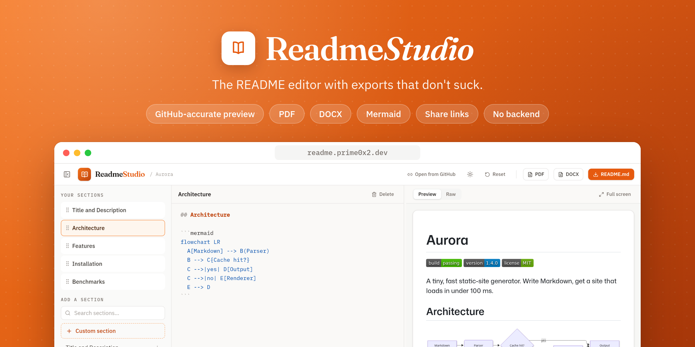
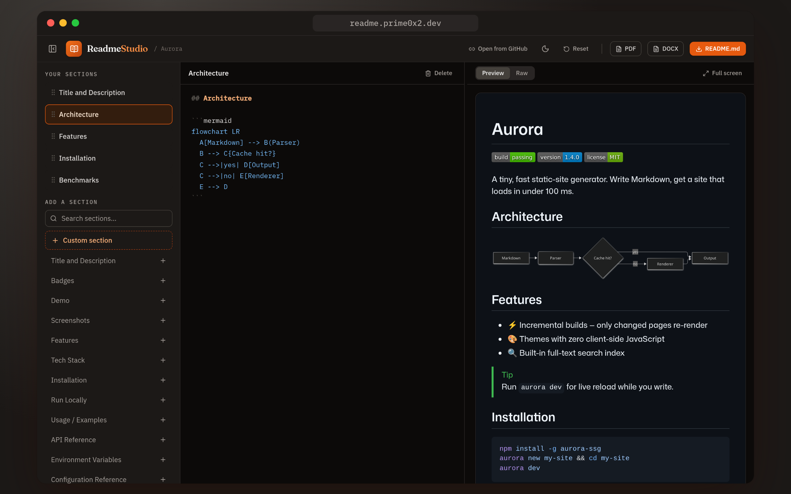
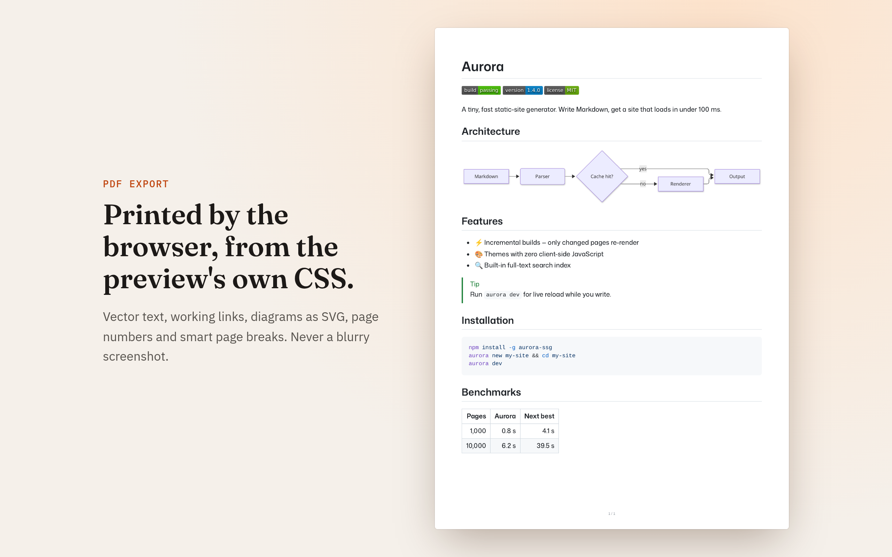
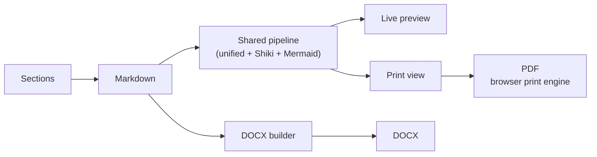

<p align="center">
  <a href="https://readme.prime0x2.dev">
    
  </a>
</p>

<p align="center">
  <b>Write a README once. Get it right on GitHub, in PDF and in Word.</b><br>
  Section templates, a GitHub-accurate live preview, Mermaid diagrams and share links, all running in your browser.
</p>

<p align="center">
  <a href="https://readme.prime0x2.dev"><b>Open the app →</b></a>
  &nbsp;·&nbsp; <a href="#-features">Features</a>
  &nbsp;·&nbsp; <a href="#-share-any-github-readme">Share links</a>
  &nbsp;·&nbsp; <a href="#-getting-started">Run locally</a>
  &nbsp;·&nbsp; <a href="CHANGELOG.md">Changelog</a>
</p>

<p align="center">
  <a href="https://github.com/prime0x2/readme-studio/actions/workflows/ci.yml"></a>
  <a href="https://github.com/prime0x2/readme-studio/releases/latest"></a>
  <a href="LICENSE"></a>
  <a href="https://readme.prime0x2.dev"></a>
  <br>
  
  
  
  
  
</p>

---

## 💡 Why

[readme.so](https://readme.so) made writing READMEs easy. But the moment you need that README somewhere other than GitHub (a PDF for a client, a Word doc for a handover), most tools hand you a blurry screenshot or lose half the styling.

ReadmeStudio keeps the section-based editor and makes the **exports first-class**. The PDF is printed by your browser from the *same* HTML and CSS as the preview, so they can't drift apart. The DOCX is built natively from the Markdown, with real Word headings, tables and code. There's no server: your document never leaves your machine.

## ✨ Features

- 🧩 **Section-based editing.** A searchable library of section templates (ported and improved from readme.so's MIT-licensed set, plus new ones like Docker, Badges and Monorepo layout). Click to add, drag to reorder, reset to default, restore from trash.
- 👀 **GitHub-accurate preview.** GFM tables, task lists, Shiki syntax highlighting, badges and inline HTML, `<picture>` dark/light images, `> [!NOTE]` alerts and emoji shortcodes, in light and dark themes plus a raw-Markdown tab. Checked against GitHub's own rendering by the test suite.
- 📊 **Mermaid diagrams.** ` ```mermaid ` blocks render in the preview, as vector SVG in the PDF and as crisp images in the DOCX. Invalid diagrams fall back to a code block.
- 📄 **Real PDF export.** Printed by the browser's own engine from the preview's stylesheet: A4, page numbers, smart page breaks, selectable text, working links, vector diagrams, Bengali and other scripts.
- 📝 **Native DOCX export.** Word heading styles (the navigation pane works), GitHub-like tables sized from real image widths, highlighted code, alerts, diagrams and badges as crisp 2× images.
- 🔗 **Preview and share any GitHub README.** A read-only, shareable view of any public README, with PDF and DOCX download and **Edit a copy**. See [below](#-share-any-github-readme).
- 🎯 **Focus tools.** Collapse the sidebar, or expand the preview to fill the window.
- ⌨️ **A real editor.** CodeMirror 6 with Markdown highlighting, list continuation, per-section undo history and formatting shortcuts.
- 💾 **Auto-save.** Your document persists in the browser as you type. No account, no sign-up.

## 📸 Screenshots

<table>
  <tr>
    <td width="50%"></td>
    <td width="50%"></td>
  </tr>
  <tr>
    <td align="center"><sub>Dark mode, with a live Mermaid diagram</sub></td>
    <td align="center"><sub>The exported PDF: vector text, diagrams and tables</sub></td>
  </tr>
</table>

## 🔗 Share any GitHub README

Put a GitHub link after `/view?url=` and you get a clean, shareable preview with PDF, DOCX and Markdown download. **Edit a copy** splits it into sections in the editor.

| Link | Opens |
| --- | --- |
| `/view?url=https://github.com/<owner>/<repo>` | The repository's README |
| `/gh/<owner>/<repo>` | The same, shorter |
| `/view?url=<file on github.com, raw.githubusercontent.com URL or gist>` | That file |
| Add `mode=full` to any of the above | A distraction-free reading view |

Relative images and links resolve against the repository, just like on GitHub. For example, this README: **<https://readme.prime0x2.dev/gh/prime0x2/readme-studio>**

## ⌨️ Keyboard shortcuts

| Shortcut | Action |
| --- | --- |
| <kbd>Ctrl</kbd>/<kbd>⌘</kbd> + <kbd>\\</kbd> | Show or hide the sections sidebar |
| <kbd>Esc</kbd> | Leave full screen |
| <kbd>Ctrl</kbd>/<kbd>⌘</kbd> + <kbd>B</kbd> / <kbd>I</kbd> | Bold / italic |
| <kbd>Ctrl</kbd>/<kbd>⌘</kbd> + <kbd>K</kbd> | Insert a link |

## 🧠 How it works



Everything that affects rendering lives in one Markdown pipeline (`src/shared/`), so the preview and the PDF use the same HTML and CSS. The PDF is the browser's own print output; the DOCX is built in the browser from the Markdown syntax tree. The only network requests are the images your README links to, the GitHub README you open, and, for images whose host blocks cross-origin reads, an image proxy ([wsrv.nl](https://wsrv.nl), used only for those images and configurable with `VITE_IMAGE_PROXY`).

## 🗂 Project structure

```
src/              Vite + React 19 + Tailwind v4 + Zustand: editor, share links,
                  PDF (print) and DOCX export
src/shared/       markdown pipeline, preview CSS, section templates, types
                  (single source of truth so preview and PDF can never drift)
tests/            Vitest suites, including headless-Chromium browser tests
scripts/          one-off generators for the social card and README images
```

## 🚀 Getting started

Requires **Node ≥ 22.13** (development uses 24, see `.nvmrc`) and **pnpm ≥ 10**. pnpm switches to the exact version pinned in `package.json` on its own.

```bash
git clone https://github.com/prime0x2/readme-studio.git
cd readme-studio
./dev_setup.sh   # checks node/pnpm, copies the .env example, installs (safe to re-run)
pnpm dev         # http://localhost:3000
```

| Script | What it does |
| --- | --- |
| `pnpm dev` | Dev server with hot reload |
| `pnpm build` | Type-check and production build into `dist/` |
| `pnpm test` | All tests, including the headless-Chromium suites |
| `pnpm lint` / `pnpm format` | Biome check / fix |
| `pnpm preview` | Build, then serve in Cloudflare's local runtime (`wrangler dev`) |
| `pnpm run deploy` | Build and deploy to Cloudflare Workers |
| `pnpm fixtures:update` | Refresh the GitHub parity fixtures |

## 🧪 Testing

136 tests, including real-browser suites that drive headless Chromium:

- **GitHub parity:** `tests/github-parity/` renders each fixture twice, once from GitHub's own HTML (GitHub's Markdown API, styled with `github-markdown-css`) and once through our pipeline with the app's real CSS. It then compares which images are shown, their sizes, floats and alignment, which images share a line, and table shapes, in light and dark.
- **Mermaid:** `tests/mermaid/` runs the real renderer and checks that labels are visible, diagrams follow the theme, invalid diagrams stay code and diagram labels can't run script.
- **PDF and DOCX:** the print path is rendered to real PDFs (A4, page numbers, diagrams, Bengali); DOCX output is checked for structure, tables, images and fonts.

<details>
<summary>More on the parity fixtures</summary>

<br>

Text isn't compared, since fonts legitimately differ. Images point at `https://img.readmestudio.test/<w>x<h>/<name>.svg` and are generated at that size by the test, so it runs offline.

The GitHub side follows GitHub's theme, including github.com's rule for `#gh-dark-mode-only` / `#gh-light-mode-only` links. Our side runs with the viewer's OS preference set to the *opposite* theme, because the preview must follow the app's theme toggle rather than the OS.

To add a case, write a new `tests/github-parity/fixtures/<name>.md` and fetch GitHub's rendering (set `GITHUB_TOKEN` to lift the 60 requests/hour limit):

```bash
pnpm fixtures:update
```

</details>

## ☁️ Deployment

Production runs at **<https://readme.prime0x2.dev>** on **Cloudflare Workers** as an assets-only Worker: no server code, just `dist/` served from Cloudflare's edge on the free plan. `wrangler.jsonc` holds the whole setup: the assets directory, a single-page-app fallback (so `/view?url=…` and `/gh/<owner>/<repo>` links load the app) and the custom domain.

- **Manual deploy:** `pnpm run deploy` builds and runs `wrangler deploy`. The first run opens a browser to log in to Cloudflare.
- **Automatic deploys:** in the Cloudflare dashboard, go to *Workers & Pages → Create → Import a repository*, then set the build command to `pnpm build` and the deploy command to `npx wrangler deploy`. Every push to `main` deploys, and other branches get preview URLs. CI also runs `wrangler deploy --dry-run`, so a broken config fails the PR rather than the deploy.
- **Your own domain:** change `routes` in `wrangler.jsonc`, or remove it to use the `*.workers.dev` URL. The zone must be on the same Cloudflare account and the hostname must not already have a DNS record; Wrangler creates it.
- **Visitor analytics:** [Cloudflare Web Analytics](https://developers.cloudflare.com/web-analytics/), a cookie-less beacon that counts real human page views. Its token is public (it ships in the page source), so it lives in the committed `.env.production`, and only production builds load it.

## 🗺 Roadmap

- **Share a draft by link.** Put the compressed Markdown in the URL fragment (`/s#…`), which never reaches any server. The link opens the same read-only view as `/view`, with downloads and **Edit a copy**. There's no storage and nothing expires; the limit is URL length (comfortably tens of KB of compressed Markdown).
- **End-to-end tests** for full flows: edit sections, download each format, validate the files.
- Import a local `README.md` file (GitHub links can already be imported with **Edit a copy**).
- Multiple documents with a document switcher.
- More section template packs.

## 🤝 Contributing

Issues and pull requests are welcome. Before opening a PR, run `pnpm lint && pnpm test`; the husky pre-commit hook runs Biome for you. For bigger changes, open an issue first so we can agree on the approach.

## 🙏 Credits

The section-editor interaction model and the original section template texts come from [readme.so](https://github.com/octokatherine/readme.so) by Katherine Oelsner (MIT License). ReadmeStudio is an independent project with its own design and export engine. The original product spec lives in [SPEC.md](./SPEC.md).

## 📄 License

[MIT](./LICENSE) © 2026 prime0x2
