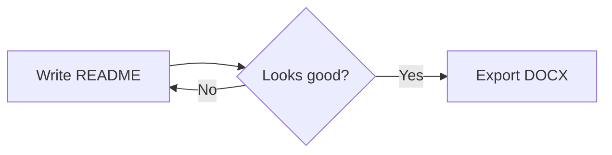
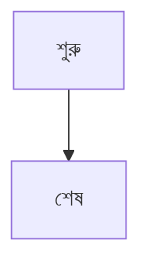
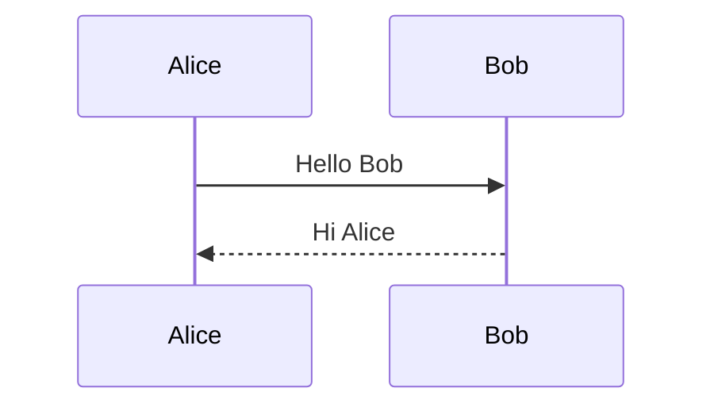

# ReadmeStudio DOCX check বাংলা

এটি একটি পরীক্ষামূলক অনুচ্ছেদ। **গাঢ় লেখা** and *italic* and `inline code`.

> [!NOTE]
> Alerts should show a colored title.

> [!WARNING]
> Careful here.
>
> > A plain quote nested in the warning (should be gray).

## Wide table

| Column A | Column B | Column C | Column D | Column E | Column F | Column G | Column H | Column I |
|---|---|---|---|---|---|---|---|---|
| some long-ish value here | another long value | yet another long value | value | value value value | value | value | value | the last column value that is long |

## Badges in a table

| Category | Technologies |
|---|---|
| Languages |   |

## Diagrams





## Code and lists

```ts
const greeting: string = "hello";
console.log(greeting);
```

1. First
2. Second
   - nested bullet
- [x] done task
- [ ] open task

[](https://x.test/#gh-dark-mode-only)
[](https://x.test/#gh-light-mode-only)



Broken one stays as code:

```mermaid
flowchart LR
  A --> 
  ??? oops
```

## Long section

Paragraph 1 — filler text so the document spans more than one page and page numbers can be checked.

Paragraph 2 — filler text so the document spans more than one page and page numbers can be checked.

Paragraph 3 — filler text so the document spans more than one page and page numbers can be checked.

Paragraph 4 — filler text so the document spans more than one page and page numbers can be checked.

Paragraph 5 — filler text so the document spans more than one page and page numbers can be checked.

Paragraph 6 — filler text so the document spans more than one page and page numbers can be checked.

Paragraph 7 — filler text so the document spans more than one page and page numbers can be checked.

Paragraph 8 — filler text so the document spans more than one page and page numbers can be checked.

Paragraph 9 — filler text so the document spans more than one page and page numbers can be checked.

Paragraph 10 — filler text so the document spans more than one page and page numbers can be checked.

Paragraph 11 — filler text so the document spans more than one page and page numbers can be checked.

Paragraph 12 — filler text so the document spans more than one page and page numbers can be checked.

Paragraph 13 — filler text so the document spans more than one page and page numbers can be checked.

Paragraph 14 — filler text so the document spans more than one page and page numbers can be checked.

Paragraph 15 — filler text so the document spans more than one page and page numbers can be checked.

Paragraph 16 — filler text so the document spans more than one page and page numbers can be checked.

Paragraph 17 — filler text so the document spans more than one page and page numbers can be checked.

Paragraph 18 — filler text so the document spans more than one page and page numbers can be checked.

Paragraph 19 — filler text so the document spans more than one page and page numbers can be checked.

Paragraph 20 — filler text so the document spans more than one page and page numbers can be checked.

Paragraph 21 — filler text so the document spans more than one page and page numbers can be checked.

Paragraph 22 — filler text so the document spans more than one page and page numbers can be checked.

Paragraph 23 — filler text so the document spans more than one page and page numbers can be checked.

Paragraph 24 — filler text so the document spans more than one page and page numbers can be checked.

Paragraph 25 — filler text so the document spans more than one page and page numbers can be checked.

Paragraph 26 — filler text so the document spans more than one page and page numbers can be checked.

Paragraph 27 — filler text so the document spans more than one page and page numbers can be checked.

Paragraph 28 — filler text so the document spans more than one page and page numbers can be checked.

Paragraph 29 — filler text so the document spans more than one page and page numbers can be checked.

Paragraph 30 — filler text so the document spans more than one page and page numbers can be checked.

